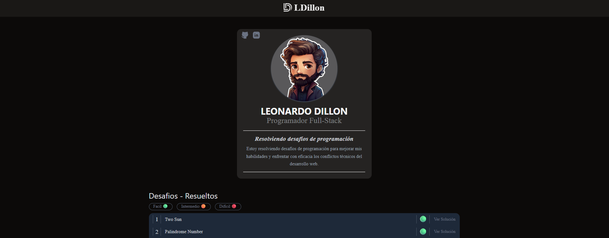

<div align="left"> 
  
  <strong  style="font-size: 24px;">Leonardo Dillon</strong>
</div>
<div align="center">
  
</div>

<h2 align="center">Programador Full-Stack</h2>

<p align="center">
  <em>Resolviendo desafíos de programación</em>
</p>

---

## ✨ Sobre el proyecto

Como desarrollador me gusta realizar desafíos técnicos. <br /> Estos desafíos me permiten mejorar mi lógica de programación y además me gusta enfrentarme a desafíos que requieren de pensamiento crítico y creatividad.

La mayoría de los desafíos que resuelvo provienen de la plataforma
<a href="https://leetcode.com/problems" title="Ir a LeetCode">LeetCode</a>, un sitio muy completo que reúne problemas de distintas temáticas y niveles de dificultad.

Cada desafío que completo lo documento dentro de este proyecto, organizándolo por nivel de dificultad (Fácil, Medio, o Difícil) y acompañándolo con un enlace directo a la solución implementada.

Mi objetivo con este repositorio es compartir mi forma de resolver los distintos desafíos y dejar registro de los avances que voy logrando.


---

## 🌐 Redes

<p align="center">
  <a href="https://github.com/leo-dillon" target="_blank">
    
  </a>
  <a href="https://www.linkedin.com/in/leonardo-dillon-jeannoteguy-1878b515a/" target="_blank">
    
  </a>
</p>

---
## 📦 Instalación y uso
Cloná el repositorio y levantá el entorno localmente:
```bash
git clone https://github.com/leo-dillon/Desafios.git
cd Desafios
npm install
npm run dev

